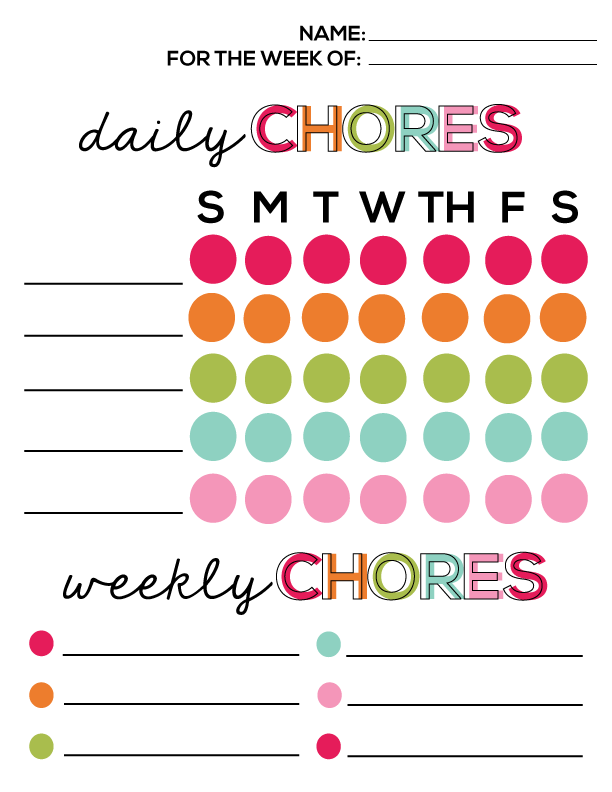
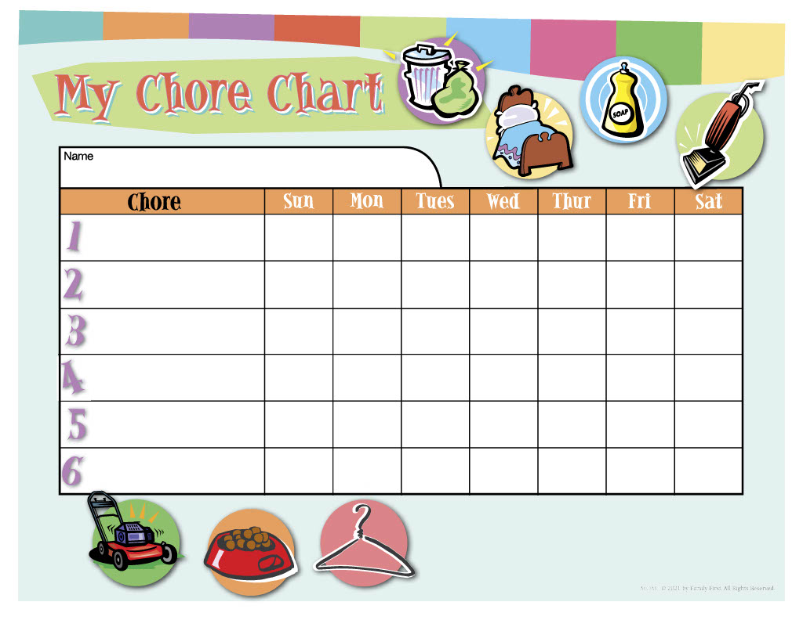
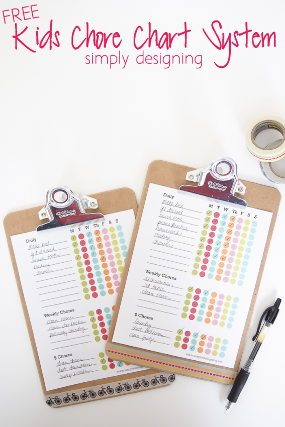

# Chore Tracker

A simple app to track weekly chores and pay out.

## Features

- Work offline. ( After initial load )
- Weekly chores tacked
- Dashboard overview
- Customizable

## Tech Goals

- Use modern CSS techniques to build the interface.
  - CSS Grid
  - Container Queries
  - :has() selector
- Lightweight SPA implementation
- Accessibility

## Design Inspiration

