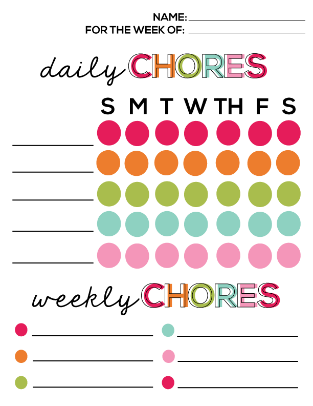
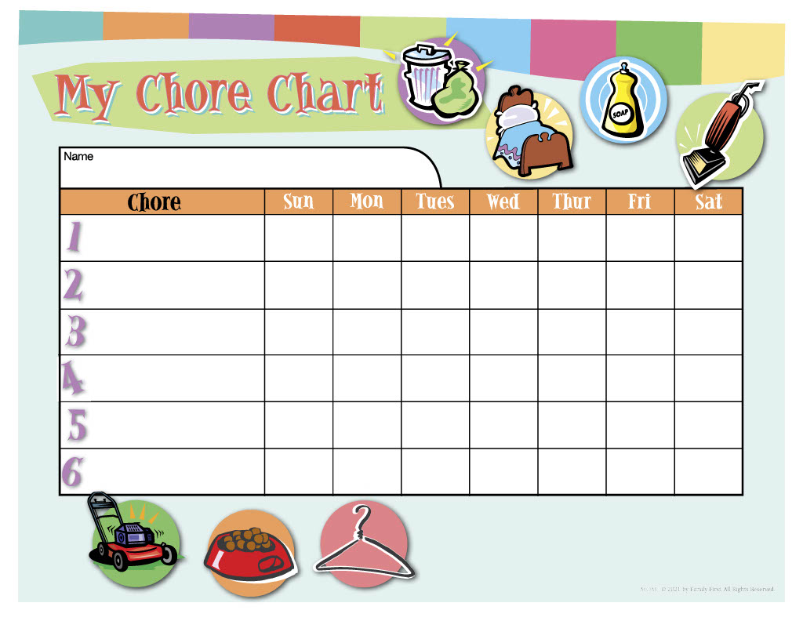

# ChoreChart

A modern web application for managing household chores and tasks with a focus on daily and weekly tracking.

## 🚀 Tech Stack

- **Frontend Framework**: React 19 with TypeScript
- **Build Tool**: Vite 6
- **Routing**: React Router DOM 7
- **State Management**: React Context API
- **Local Storage**: LocalForage
- **Styling**: CSS Modules with modern CSS features

## 📁 Project Structure

```text
ChoreChart/
├── src/
│   ├── components/         # Reusable UI components
│   │   ├── ChoreForm.tsx   # Form for adding/editing chores
│   │   ├── ChoreListDaily.tsx
│   │   ├── ChoreListWeekly.tsx
│   │   ├── Header.tsx
│   │   └── ...
│   ├── pages/             # Route components
│   │   ├── Dashboard.tsx
│   │   ├── EditChores.tsx
│   │   ├── Home.tsx
│   │   └── ErrorPage.tsx
│   ├── context/           # React Context providers
│   ├── utils/             # Utility functions
│   ├── types.ts           # TypeScript type definitions
│   └── interfaces.ts      # Data model interfaces
├── public/                # Static assets
└── docs/                  # Documentation
```

## ✨ Features

- **Chore Management**

  - Create, edit, and delete chores
  - Set chore frequency (daily/weekly)
  - Assign prices/rewards for chores
  - Add descriptions for each chore

- **Tracking System**

  - Daily chore tracking
  - Weekly chore tracking
  - Visual completion status
  - Week navigation

- **Data Persistence**

  - Local storage for chore data
  - Automatic data saving

- **User Interface**
  - Clean, modern design
  - Responsive layout
  - Intuitive navigation
  - Error handling

## 🛠️ Development

### Prerequisites

- Node.js (latest LTS version recommended)
- npm or yarn

### Getting Started

1. Clone the repository
2. Install dependencies:
   ```bash
   npm install
   ```
3. Start the development server:
   ```bash
   npm run dev
   ```
4. Build for production:
   ```bash
   npm run build
   ```

### Seed Data

The application comes with pre-configured seed data in `src/TEMP_DATA.ts`. This data includes:

- 20 predefined chores
- Mix of daily and weekly tasks
- Appropriate pricing based on task complexity
- Detailed descriptions for each chore

The seed data is automatically loaded when the application starts for the first time. The data is then stored in the browser's local storage for persistence.

To reset to the default seed data:

1. Clear your browser's local storage for the application
2. Refresh the page

The application will automatically reinitialize with the default seed data.

## 📝 Data Model

The application uses a structured data model for chores:

- **Chore**: Basic chore information (id, name, description, price, frequency)
- **DailyChore**: Extends Chore with daily tracking information
- **WeeklyChoreTrack**: Weekly chore tracking with completion status
- **WeeklyChoreGroup**: Groups daily and weekly chores for a specific week

## 🤝 Contributing

Contributions are welcome! Please feel free to submit a Pull Request.

## 📄 License

This project is licensed under the MIT License - see the LICENSE file for details.

## Tech Goals

- Use modern CSS techniques to build the interface.
  - CSS Grid
  - Container Queries
  - :has() selector
- Lightweight SPA implementation
- Accessibility

## Design Inspiration






