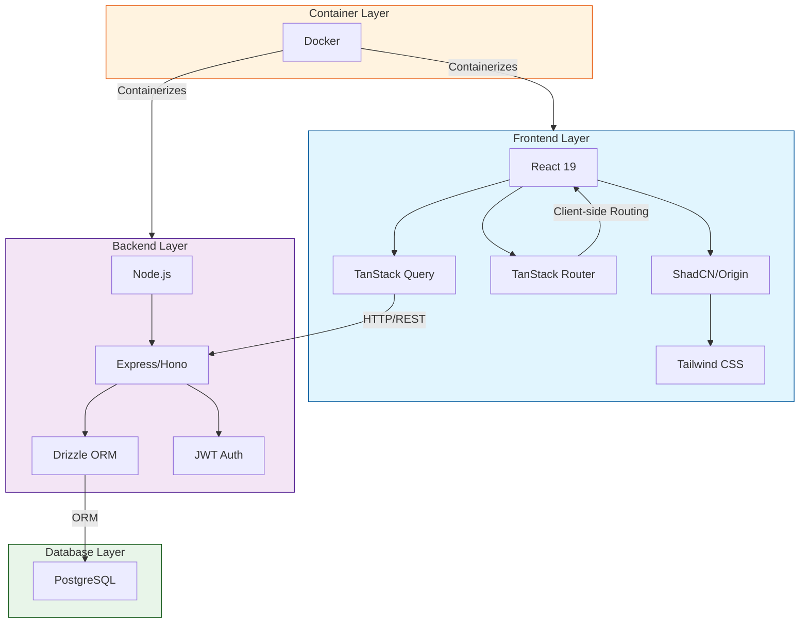

# Chore Chart App - Architecture Diagram

## System Architecture Overview

## Component Descriptions

### Frontend Layer

- **React 19**: Core UI framework
- **TanStack Query**: Data fetching and state management
- **TanStack Router**: Client-side routing solution
- **ShadCN/Origin**: UI component library
- **Tailwind CSS**: Utility-first CSS framework

### Backend Layer

- **Node.js**: Runtime environment
- **Express/Hono**: Web framework
- **Drizzle ORM**: Database ORM
- **JWT Auth**: Authentication system

### Database Layer

- **PostgreSQL**: Production-grade relational database

### Container Layer

- **Docker**: Containerization platform

## Data Flow

1. Frontend makes HTTP requests through TanStack Query
2. Backend processes requests through Express/Hono
3. Drizzle ORM handles database operations
4. JWT handles authentication/authorization
5. Data flows back to frontend through REST API
