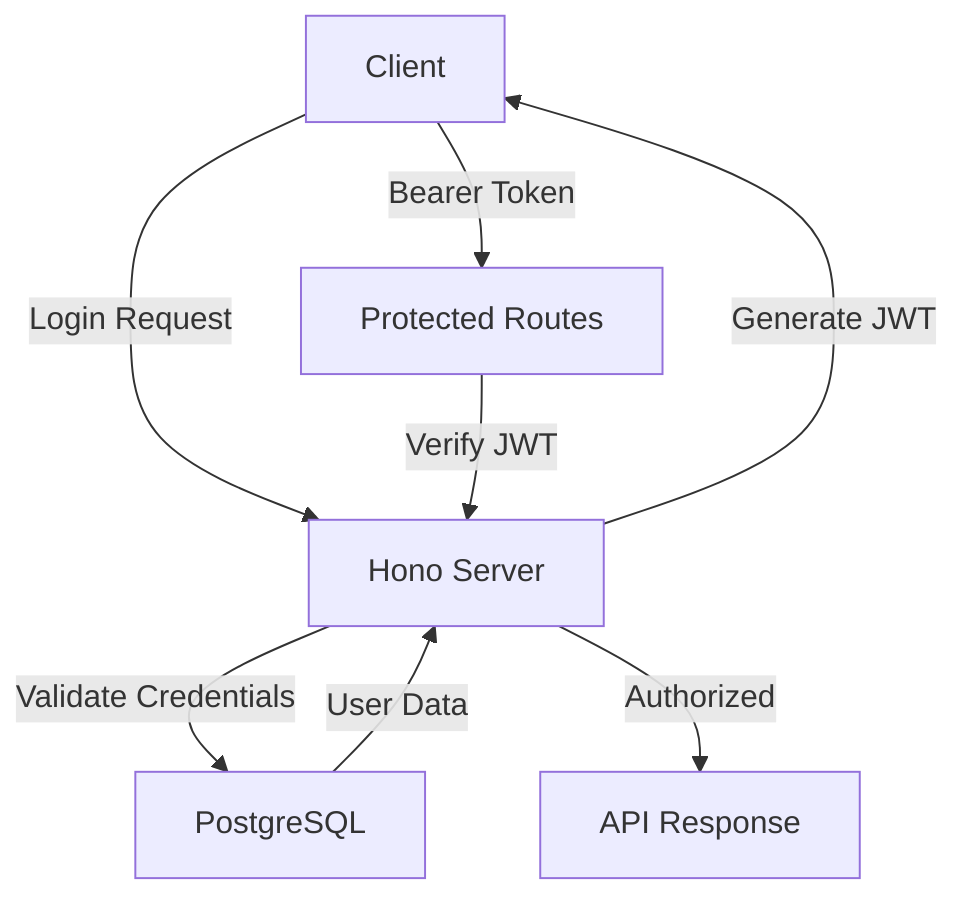

# Authentication System Documentation

## Overview

The Chore Chart App uses JWT (JSON Web Tokens) for authentication, implemented using Hono's built-in JWT middleware. This provides a secure, stateless authentication system that works seamlessly with our PostgreSQL database.

## Architecture



## Components

### 1. JWT Middleware

- Uses Hono's built-in JWT middleware
- Handles token verification
- Manages token expiration
- Provides payload access in protected routes

### 2. Authentication Routes

- `/api/v1/auth/register` - User registration
- `/api/v1/auth/login` - User login
- `/api/v1/auth/refresh` - Token refresh
- `/api/v1/auth/logout` - User logout

### 3. User Types

```typescript
interface User {
	id: string;
	email: string;
	role: "parent" | "child";
	createdAt: Date;
}

interface JWTPayload {
	sub: string; // user id
	email: string;
	role: "parent" | "child";
	iat: number; // issued at
	exp: number; // expiration
}
```

## Security Measures

### 1. Token Management

- Access tokens expire after 15 minutes
- Refresh tokens expire after 7 days
- Tokens are stored in HTTP-only cookies
- CSRF protection enabled

### 2. Password Security

- Passwords are hashed using bcrypt
- Minimum password length: 8 characters
- Password complexity requirements enforced

### 3. Rate Limiting

- Login attempts limited to 5 per minute
- Registration limited to 3 per hour per IP

## Implementation Details

### 1. JWT Configuration

```typescript
const jwtConfig = {
	secret: process.env.JWT_SECRET,
	cookie: "auth_token",
	alg: "HS256",
	exp: "15m", // 15 minutes
};
```

### 2. Protected Route Example

```typescript
app.use(
	"/api/v1/*",
	jwt({
		secret: process.env.JWT_SECRET,
	})
);

app.get("/api/v1/protected", (c) => {
	const payload = c.get("jwtPayload");
	return c.json({ message: "Protected route", user: payload });
});
```

### 3. Error Handling

- Invalid token: 401 Unauthorized
- Expired token: 401 Unauthorized
- Missing token: 401 Unauthorized
- Invalid role: 403 Forbidden

## Frontend Integration

### 1. Authentication Context

```typescript
interface AuthContext {
	user: User | null;
	login: (email: string, password: string) => Promise<void>;
	logout: () => Promise<void>;
	isAuthenticated: boolean;
}
```

### 2. Protected Route Component

```typescript
interface ProtectedRouteProps {
	children: React.ReactNode;
	requiredRole?: "parent" | "child";
}
```

## Environment Variables

```env
JWT_SECRET=your-secure-secret-key
JWT_REFRESH_SECRET=your-secure-refresh-secret
COOKIE_SECRET=your-secure-cookie-secret
```

## Testing

### 1. Authentication Tests

- Login flow
- Registration flow
- Token refresh
- Protected route access
- Role-based access control

### 2. Security Tests

- Token validation
- Password hashing
- Rate limiting
- CSRF protection

## Best Practices

1. **Token Management**

   - Store tokens in HTTP-only cookies
   - Implement token refresh mechanism
   - Clear tokens on logout

2. **Error Handling**

   - Use consistent error responses
   - Log authentication failures
   - Implement proper error boundaries

3. **Security**

   - Regular secret rotation
   - Monitor failed login attempts
   - Implement account lockout

4. **Performance**
   - Cache user data
   - Optimize token validation
   - Minimize database queries

## Future Improvements

1. **Multi-factor Authentication**

   - Email verification
   - SMS verification
   - Authenticator app support

2. **Social Authentication**

   - Google OAuth
   - GitHub OAuth
   - Apple Sign-in

3. **Advanced Security**
   - Device fingerprinting
   - Location-based access
   - Session management
