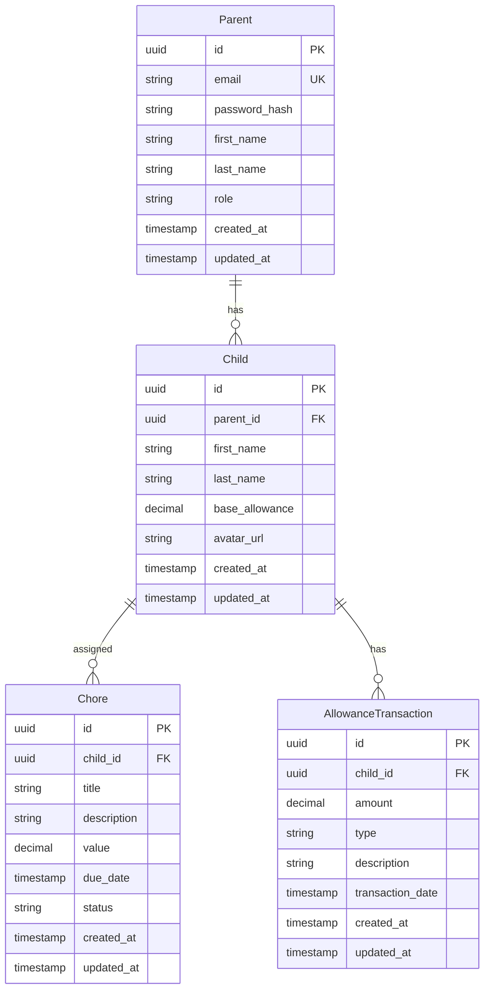

# Database Schema Documentation

## Entity Relationship Diagram

## Database Architecture

### Core Entities

1. **Parent**

   - Primary user account
   - Manages children and chores
   - Handles allowance distribution

2. **Child**

   - Managed by parent
   - Has assigned chores
   - Tracks allowance earnings

3. **Chore**

   - Assigned to children
   - Has monetary value
   - Tracks completion status

4. **Allowance Transaction**
   - Records financial transactions
   - Tracks earnings and payments
   - Maintains financial history

### Relationships

- One-to-Many: Parent to Children
- One-to-Many: Child to Chores
- One-to-Many: Child to Allowance Transactions

## Data Integrity

### Primary Keys

- UUID for all entities
- Ensures global uniqueness
- Prevents ID collisions

### Foreign Keys

- Cascading deletes for child records
- Maintains referential integrity
- Prevents orphaned records

### Constraints

1. **Parent**

   - Unique email addresses
   - Role-based access control
   - Required personal information

2. **Child**

   - Required parent association
   - Non-negative allowance values
   - Valid avatar URLs

3. **Chore**

   - Required child association
   - Non-negative values
   - Valid status transitions

4. **Allowance Transaction**
   - Required child association
   - Non-zero amounts
   - Valid transaction types

## Performance Considerations

### Indexing Strategy

1. **Primary Indexes**

   - All primary keys
   - All foreign keys
   - Unique constraints

2. **Secondary Indexes**
   - Frequently queried fields
   - Sort operations
   - Filter conditions

### Query Optimization

1. **Common Queries**

   - Child's active chores
   - Allowance history
   - Parent's children

2. **Performance Patterns**
   - Eager loading for related data
   - Pagination for large datasets
   - Efficient filtering

## Data Validation

### Input Validation

1. **Required Fields**

   - Personal information
   - Financial values
   - Status indicators

2. **Format Validation**

   - Email addresses
   - URLs
   - Monetary values

3. **Business Rules**
   - Allowance limits
   - Chore completion rules
   - Transaction types

## Migration Strategy

### Version Control

1. **Schema Changes**

   - Versioned migrations
   - Reversible changes
   - Atomic updates

2. **Data Migrations**
   - Data preservation
   - Backward compatibility
   - Rollback procedures

### Deployment Process

1. **Development**

   - Local testing
   - Schema validation
   - Data integrity checks

2. **Staging**

   - Integration testing
   - Performance testing
   - Security validation

3. **Production**
   - Zero-downtime deployment
   - Data backup
   - Monitoring

## Security Considerations

### Data Protection

1. **Sensitive Data**

   - Password hashing
   - Personal information
   - Financial records

2. **Access Control**
   - Role-based permissions
   - Data isolation
   - Audit logging

### Compliance

1. **Data Privacy**

   - GDPR compliance
   - Data retention
   - User consent

2. **Financial Regulations**
   - Transaction records
   - Audit trails
   - Reporting requirements

## Best Practices

### Development

1. **Type Safety**

   - Strong typing
   - Schema validation
   - Runtime checks

2. **Code Organization**

   - Modular design
   - Clear separation of concerns
   - Consistent patterns

3. **Testing**
   - Unit tests
   - Integration tests
   - Data integrity tests

### Operations

1. **Monitoring**

   - Performance metrics
   - Error tracking
   - Usage patterns

2. **Maintenance**

   - Regular backups
   - Index optimization
   - Data cleanup

3. **Documentation**
   - Schema changes
   - Migration procedures
   - Troubleshooting guides
