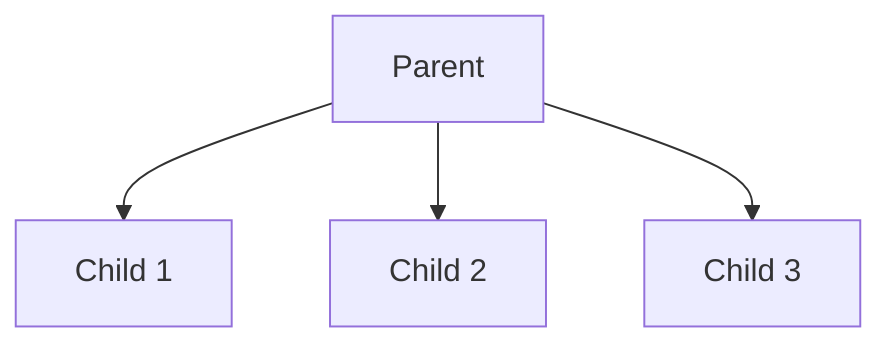

# Role-Based Access Control (RBAC) Documentation

## Overview

The Chore Chart App implements a simple parent-child RBAC system to manage access control. This system ensures that parents can manage their children's chores and allowances while children can only access their own data.

## Role Hierarchy



## Role Definitions

### 1. Parent

- **Description**: Account holder managing children and chores
- **Responsibilities**:
  - Manage child accounts
  - Create and assign chores
  - Verify chore completion
  - Manage allowance settings
- **Permissions**:
  - `children:manage` (Create, read, update child profiles)
  - `chores:manage` (Create, read, update, delete chores)
  - `allowance:manage` (Set and modify allowance rules)
  - `verification:manage` (Verify chore completion)

### 2. Child

- **Description**: End user performing chores
- **Responsibilities**:
  - View assigned chores
  - Mark chores as complete
  - Track allowance earnings
- **Permissions**:
  - `chores:view` (View assigned chores)
  - `chores:complete` (Mark chores as complete)
  - `allowance:view` (View earned allowance)

## Permission Structure

```typescript
type Permission =
	| "children:manage"
	| "chores:manage"
	| "chores:view"
	| "chores:complete"
	| "allowance:manage"
	| "allowance:view"
	| "verification:manage";

interface Role {
	name: string;
	permissions: Permission[];
}
```

## Parent-Child Relationships

### 1. Data Model

```typescript
interface User {
	id: string;
	email: string;
	role: "parent" | "child";
	permissions: Permission[];
}

interface Family {
	id: string;
	name: string;
	createdAt: Date;
}

interface FamilyMember {
	userId: string;
	familyId: string;
	role: "parent" | "child";
	joinedAt: Date;
}

// Example relationships
const familyStructure = {
	family1: {
		id: "f1",
		name: "Smith Family",
		members: [
			{ userId: "p1", role: "parent" }, // Parent
			{ userId: "c1", role: "child" }, // Child 1
			{ userId: "c2", role: "child" }, // Child 2
		],
	},
};
```

### 2. Permission Inheritance

```typescript
interface FamilyPermission extends Permission {
	familyId: string;
	scope: "family" | "child";
	childId?: string; // Required if scope is 'child'
}

// Example permissions
const familyPermissions = {
	// Family-level permissions
	"family:manage": {
		description: "Manage family settings and members",
		roles: ["parent"],
	},
	"family:view": {
		description: "View family information",
		roles: ["parent", "child"],
	},
	// Child-specific permissions
	"child:manage": {
		description: "Manage specific child",
		roles: ["parent"],
		scope: "child",
	},
};
```

### 3. Implementation Example

```typescript
// Check if user has access to a specific child
const checkChildAccess = async (userId: string, childId: string) => {
	const user = await getUser(userId);
	const child = await getUser(childId);

	// Get family memberships
	const userFamily = await getFamilyMembership(userId);
	const childFamily = await getFamilyMembership(childId);

	// Check if they're in the same family
	if (userFamily.familyId !== childFamily.familyId) {
		return false;
	}

	// Parents have access to all children in their family
	if (user.role === "parent") {
		return true;
	}

	// Children can only access their own data
	return userId === childId;
};

// Middleware to check family access
const checkFamilyAccess = (requiredPermission: FamilyPermission) => {
	return async (c: Context, next: Next) => {
		const user = c.get("user");
		const { familyId, childId } = c.req.param();

		const hasAccess = await checkChildAccess(user.id, childId);
		if (!hasAccess) {
			return c.json({ error: "Unauthorized" }, 403);
		}

		await next();
	};
};
```

## Best Practices

1. **Family Management**

   - Parents can add/remove children
   - Children are automatically added to the family
   - Children can only access their own data

2. **Data Isolation**

   - Each family's data is isolated
   - Children can only see their own data
   - Parents can see all children's data in their family

3. **Security**

   - Log all permission changes
   - Monitor failed access attempts
   - Regular permission reviews

4. **Performance**
   - Cache role permissions
   - Optimize permission checks
   - Use efficient data structures

## Future Improvements

1. **Dynamic Roles**

   - Custom role creation
   - Role templates
   - Role inheritance

2. **Advanced Features**

   - Time-based permissions
   - Location-based access
   - Device-based restrictions

3. **Audit and Compliance**
   - Detailed access logs
   - Compliance reporting
   - Automated audits

## Parent-Child Relationships

### 1. Data Model

```typescript
interface User {
	id: string;
	email: string;
	role: "parent" | "child";
	permissions: Permission[];
}

interface Family {
	id: string;
	name: string;
	createdAt: Date;
}

interface FamilyMember {
	userId: string;
	familyId: string;
	role: "parent" | "child";
	joinedAt: Date;
}

// Example relationships
const familyStructure = {
	family1: {
		id: "f1",
		name: "Smith Family",
		members: [
			{ userId: "p1", role: "parent" }, // Parent
			{ userId: "c1", role: "child" }, // Child 1
			{ userId: "c2", role: "child" }, // Child 2
		],
	},
};
```

### 2. Permission Inheritance

```typescript
interface FamilyPermission extends Permission {
	familyId: string;
	scope: "family" | "child";
	childId?: string; // Required if scope is 'child'
}

// Example permissions
const familyPermissions = {
	// Family-level permissions
	"family:manage": {
		description: "Manage family settings and members",
		roles: ["parent"],
	},
	"family:view": {
		description: "View family information",
		roles: ["parent", "child"],
	},
	// Child-specific permissions
	"child:manage": {
		description: "Manage specific child",
		roles: ["parent"],
		scope: "child",
	},
};
```

### 3. Implementation Example

```typescript
// Check if user has access to a specific child
const checkChildAccess = async (userId: string, childId: string) => {
	const user = await getUser(userId);
	const child = await getUser(childId);

	// Get family memberships
	const userFamily = await getFamilyMembership(userId);
	const childFamily = await getFamilyMembership(childId);

	// Check if they're in the same family
	if (userFamily.familyId !== childFamily.familyId) {
		return false;
	}

	// Parents have access to all children in their family
	if (user.role === "parent") {
		return true;
	}

	// Children can only access their own data
	return userId === childId;
};

// Middleware to check family access
const checkFamilyAccess = (requiredPermission: FamilyPermission) => {
	return async (c: Context, next: Next) => {
		const user = c.get("user");
		const { familyId, childId } = c.req.param();

		const hasAccess = await checkChildAccess(user.id, childId);
		if (!hasAccess) {
			return c.json({ error: "Unauthorized" }, 403);
		}

		await next();
	};
};
```

### 4. Best Practices for Family Management

1. **Family Creation**

   - First parent becomes primary parent
   - Can invite other parents
   - Can add children

2. **Parent Management**

   - Primary parent can add/remove other parents
   - All parents have equal access to children
   - Primary parent has additional family management rights

3. **Child Management**

   - Any parent can add children
   - Children are automatically added to all parents
   - Children can only access their own data

4. **Data Isolation**
   - Each family's data is isolated
   - Children can only see their own data
   - Parents can see all children's data in their family
