# Chore Chart App - User Flows

## 1. Authentication Flows

### 1.1 Parent Registration

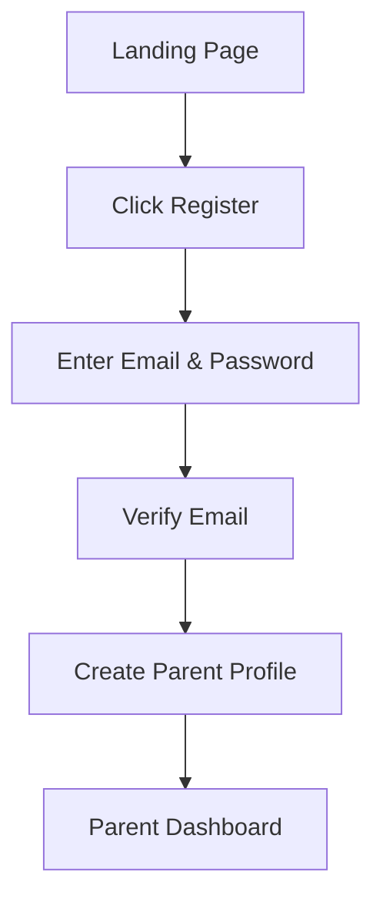

### 1.2 Parent Login

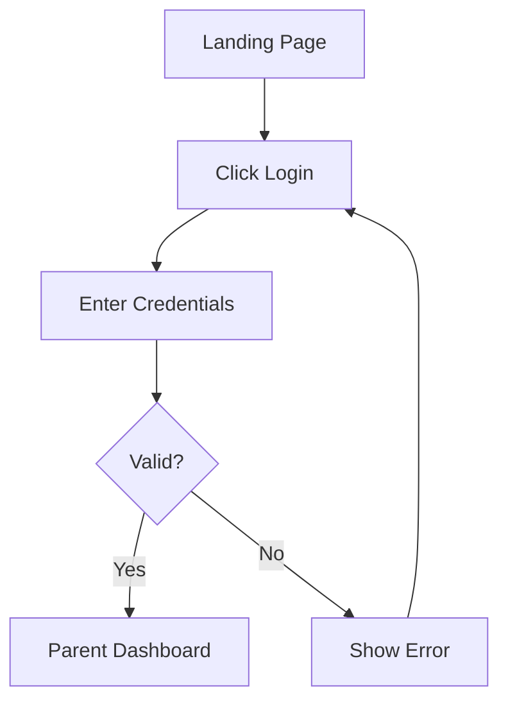

### 1.3 Child Login

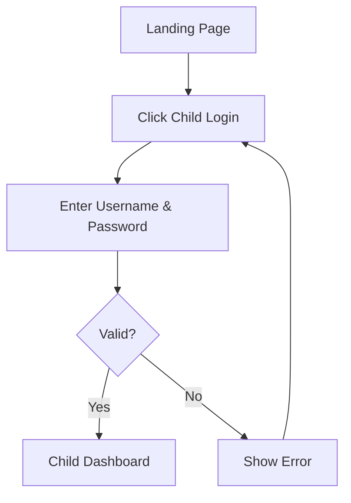

## 2. Parent Dashboard Flows

### 2.1 Child Profile Management

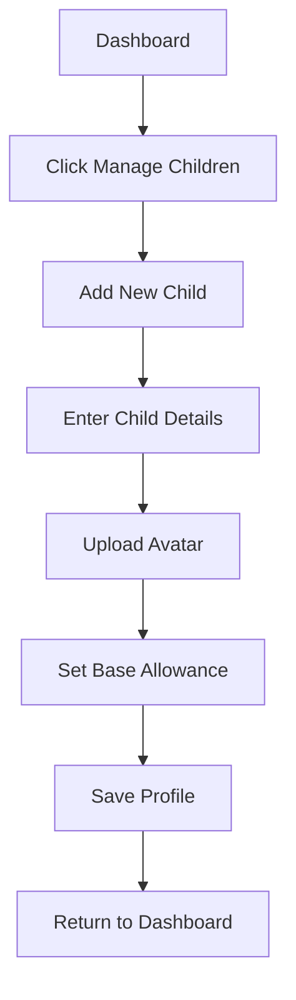

### 2.2 Chore Management

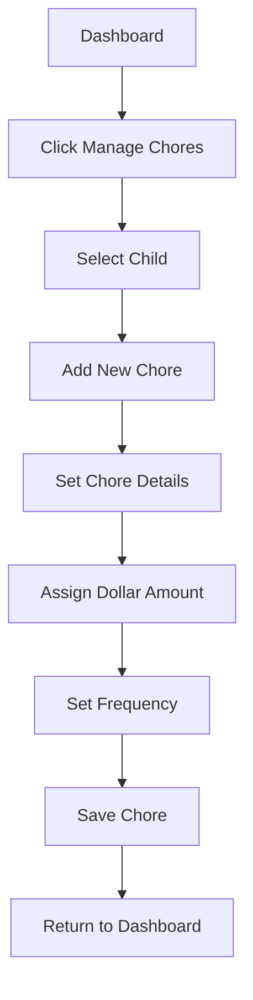

### 2.3 Chore Verification

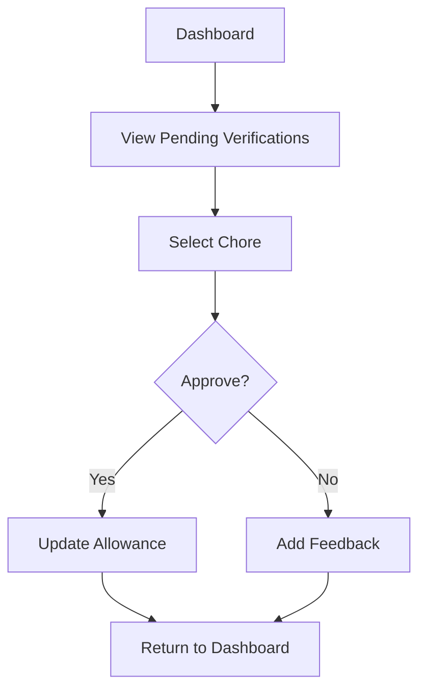

## 3. Child Dashboard Flows

### 3.1 View Chores

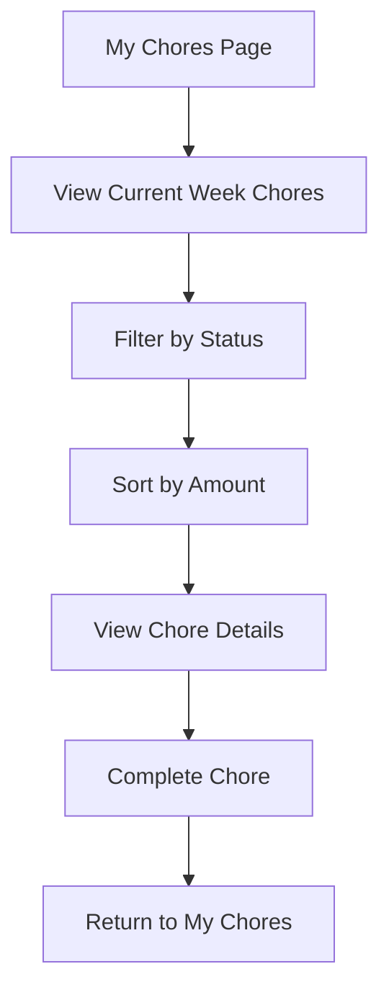

### 3.2 Complete Chore

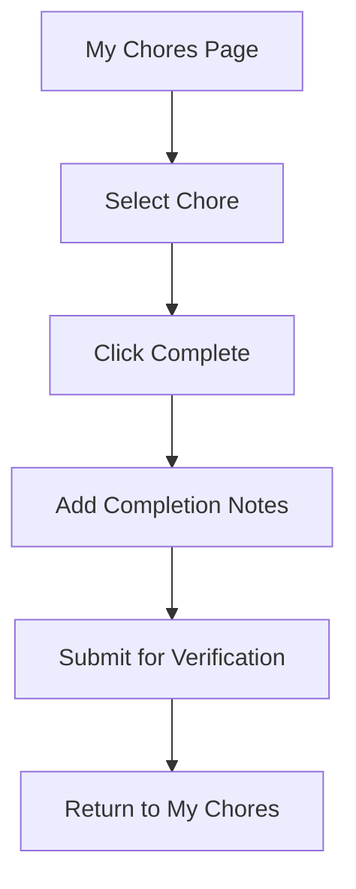

### 3.3 Track Progress

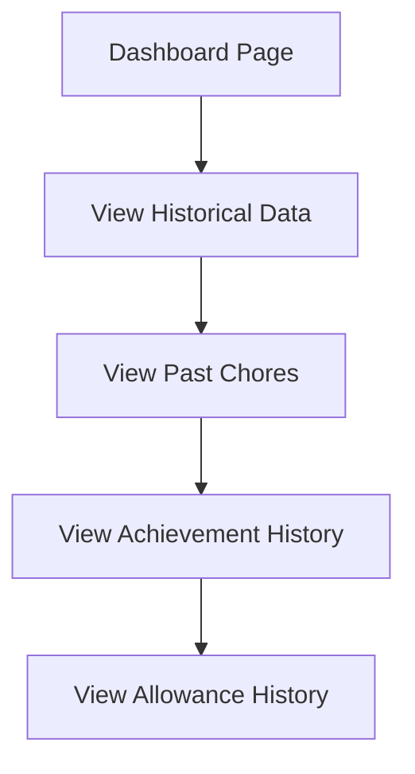

## 4. Error Handling Flows

### 4.1 Authentication Errors

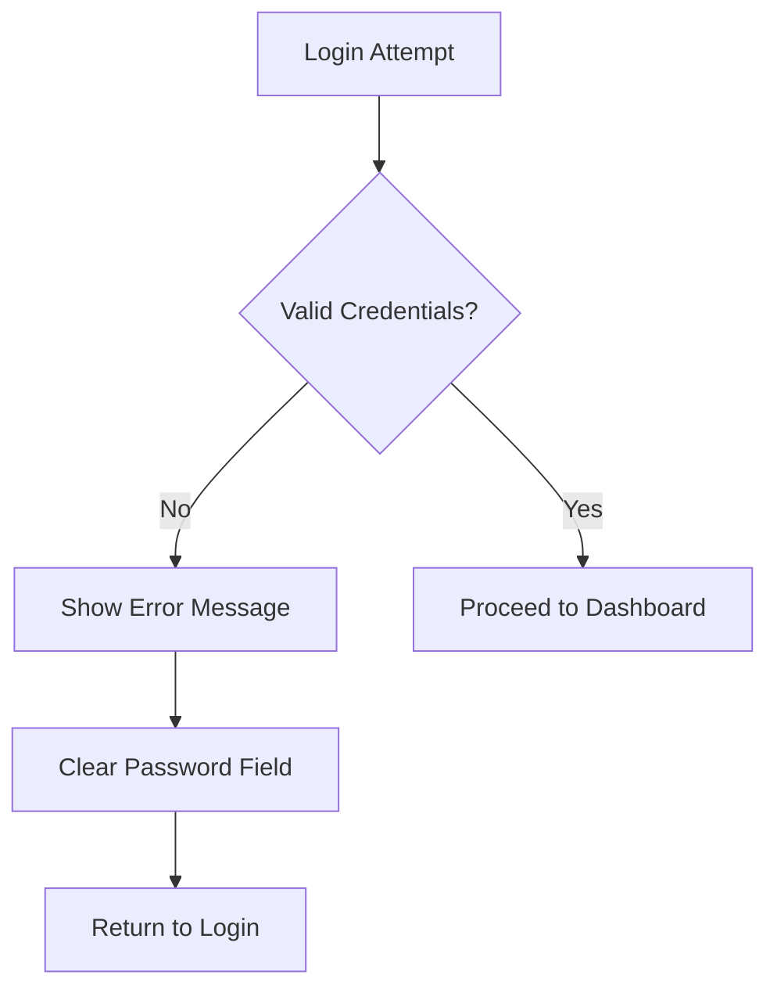

### 4.2 Chore Completion Errors

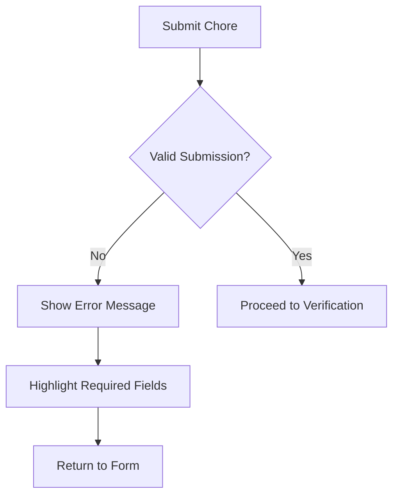

## 5. Navigation Structure

### 5.1 Parent Navigation

- Dashboard
  - Overview of All Children
  - Pending Verifications
  - Recent Activity
  - Quick Actions
- Children
  - Child Profiles
  - Individual Progress
  - Allowance Management
  - Achievement Tracking
- Chores
  - Chore Templates
  - Active Chores
  - Chore History
  - Performance Analytics
- Settings
  - Account Management
  - Notification Preferences
  - Display Settings
  - System Configuration

### 5.2 Child Navigation

- My Chores
  - Current Week View
  - Active Chores
  - Progress Overview
  - Recent Achievements
- Dashboard
  - Historical Chores
  - Achievement History
  - Allowance History
  - Performance Trends
- Settings
  - Profile Customization
  - Notification Preferences
  - Display Preferences

## 6. State Transitions

### 6.1 Chore States

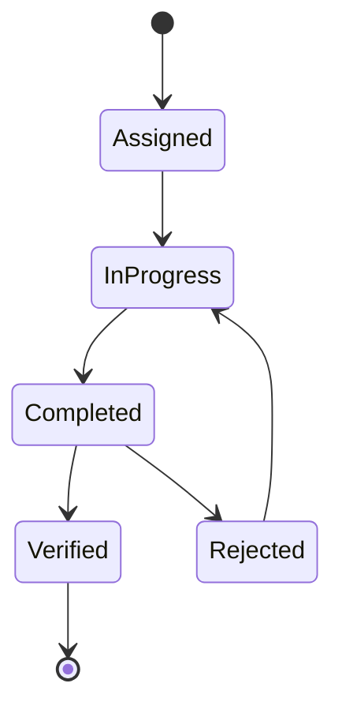

### 6.2 Allowance States

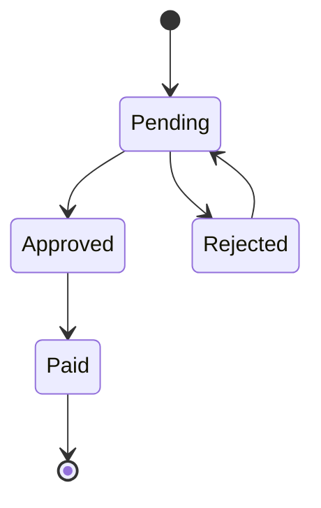

## 7. Data Flow

### 7.1 Chore Completion

1. Child marks chore complete
2. System updates chore status
3. Parent receives verification request
4. Parent verifies completion
5. System updates allowance balance
6. Dashboard refreshes with new data

### 7.2 Allowance Updates

1. Parent sets base allowance
2. System calculates potential earnings
3. Child completes chores
4. System updates running total
5. Parent verifies completion
6. System finalizes allowance amount
